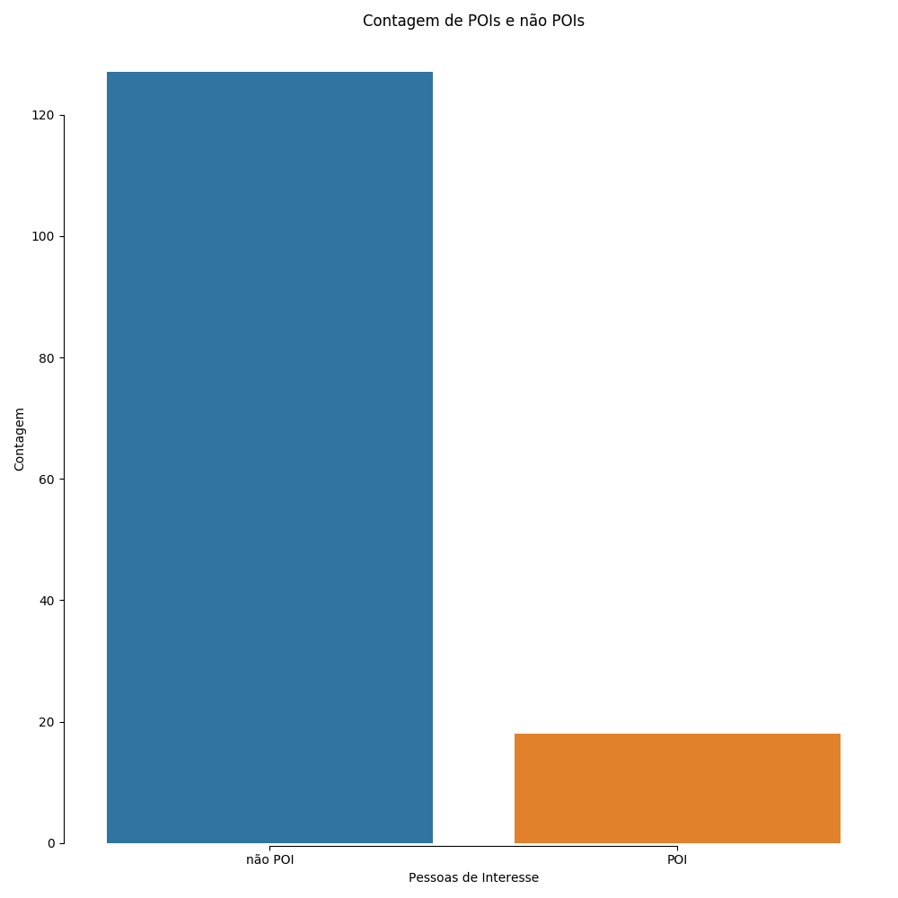
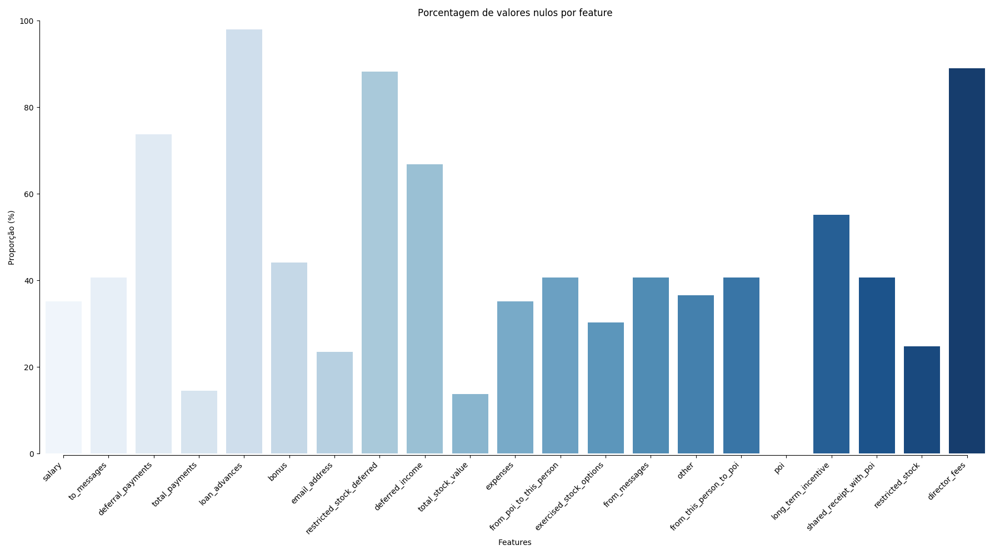

---
title:  'Enron Submission Report'
author:
- Thiago Roberto do Prado <trprado@outlook.com>
...

# Enron Submission Report

## 1.
O objetivo é identificar de 145 observações "*data points*" analisadas, pessoas de interesse (**POIs**), discriminando quais são **POIs** (18) e quais não são **POIs** (127), a contagem pode ser vista no gráfico abaixo. Ao se aplicar métodos de *Machine Learning* é possível, ao analisar os dados, modelar (treinamento) e validar (validação) o modelo formulado para predizer se futuras observações podem ser atribuídas ou não a categoria de POIs. Por exemplo, a variável X é uma variável de importância visto que **POIs** possuem maior valores monetários do que as pessoas não **POIs**, assim, uma futura observação que também possui esse valor monetário em destaque tem maior chance de ser um candidato a ser um **POI**.



Foram observados outliers nos dados *TOTAL*, com valores que na realidade são as somas de todos os demais valores do dataset; *THE TRAVEL AGENCY IN THE PARK*, uma agência de viagens que não tem relação direta com a *Enron*; *LOCKHART EUGENE E* uma pessoa onde todos os valores são nulos, e eles foram tratados com a remoção dos seus dados do *dataset*. Valores que o *IQR* score considerava como *outliers* não foram removidos, pois se tratavam de **POIs** com grande valor em seus atributos, outros são investidores que não chegam a ter alguma relação com **POIs** mas devido a não ter uma relação direta com a *Enron* seus dados como (salário, *emails* para **POIs**, etc) tinham valores nulos e foram tratados como zero. As três *features* que possuiam as maiores porcentagens de valores nulos são: `loan_advances` com quase 100% das suas observações como nulas, `restricted_stock_deferred` e `director_fees` ambas com mais de 80% de observações nulas, como pode ser observado no gráfico a seguir, é apresentada porcentagem de valores nulos em cada coluna que representa as *features*.



## 2.
As variáveis explicativas (*features*) utilizadas foram: `salary`, `total_payments`, `bonus`, `total_stock_value`, `expenses`, `from_poi_to_this_person`, `exercised_stock_options`, `other`, `shared_receipt_with_poi`, `restricted_stock` as quais foram identificadas utilizando o algoritmo *SelectKBest* devido sua forma de pegar pontuações por `f1_score` e retornar também o `p-value`, assim fica possível definir estatisticamente a importância de cada *feature*, removendo as *features* que apresentaram a contagem de valores nulos maior que 50% do seu tamanho total e selecionando aquelas com p-valor menor ou igual ao nível de significância de 5% (*alpha*). Para tal, foi criada uma função com o intuito de facilitar o uso do *SelectKBest*, com o objetivo de determinar a porcentagem de valores nulos aceitos e o nível de significância (*alpha*). Além disso, nas *features* selecionadas foram feitos testes para definir quais corresponderiam a melhores pontuações, para isso foram feitos testes a partir de duas variáveis até o total de *features* selecionadas, a pontuação segue na tabela abaixo. Porém, mesmo que alguns K tenham mostrado melhores valores em F1 isso se deve a quantidade de limitada de repetições que ocorreram, essas repetições tiveram de ser limitadas para o equipamento suportar a execução em um tempo limite. O *SelectKBest* foi escolhido por permitir que a partir de um dado K fossem selecionadas as *K-features* com melhor correlação entre si.


| Modelo | k=2 | k=4 | k=6 | k=8 | k=10 |
|---|---|---|---|---|---|
| SVC | 0.4333 | 0.4333 | 0.4333 | 0.4333 | 0.4133 |
| GNC | 0.3400 | 0.3438 | 0.3633 | 0.3133 | 0.1952 |
| DTC | 0.4833 | 0.5367 | 0.3467 | 0.4352 | 0.3852 |
| KNC | 0.5333 | 0.5167 | 0.3867 | 0.2200 | 0.1667 |
| RFC | 0.4667 | 0.5667 | 0.4167 | 0.4333 | 0.4067 |
| ADA | 0.5000 | 0.4333 | 0.4333 | 0.4333 | 0.4167 |


### Pontuação das *features* antes da seleção
```
================================================================================
Scores and p-values of all features:
================================================================================
Feature scores:
 [19.  2.  9.  21.  25.  6.  5.  25.  0.  4.  2.  9.  9.]
Feature p-values:
 [0.  0.1878  0.0032  0.  0.  0.0127  0.021  0.  0.6909  0.0407  0.1182  0.0033  0.0025]
--------------------------------------------------------------------------------
================================================================================
Feature List:
['poi', 'salary', 'deferral_payments', 'total_payments', 'loan_advances', 'bonus', 'restricted_stock_deferred', 'deferred_income', 'total_stock_value', 'expenses', 'exercised_stock_options', 'other', 'long_term_incentive', 'restricted_stock', 'director_fees', 'to_messages', 'from_poi_to_this_person', 'from_messages', 'from_this_person_to_poi', 'shared_receipt_with_poi']
================================================================================
```

Novas *features* foram criadas utilizando do algoritmo *PolynomialFeatures*, com ele foi passado duas *features* existentes, e ele gerou quatro novas *features* sendo elas `1`, `x^2`, `x*y` e `y^2`, a *feature* `'1'` foi removida por não gerar um `f1_score` ou `p-value`, as demais não foram utilizados por não gerar diferenças significativas como segue na tabela abaixo. Também foi realizado o escalonamento dos valores com *MinMaxScale*, esse escalonamento foi necessário para que alguns algoritmos de *Machine Learning* trabalhassem corretamente com as *features*.

| Modelo | F1 | Precision | Recall |
|---|---|---|---|
| Ada S/ Novas Features | 0.3538 | 0.4020 | 0.3160 |
| Ada C/ Novas Features | 0.3483 | 0.3927 | 0.3130 |

### Pontuação das *features* depois da seleção com novas *features* adicionadas
```
================================================================================
SelectKBest in selected features:
================================================================================
Best scores: [18.2897  8.7728 20.7923 24.1829  6.0942  5.2434 24.8151  4.1875  8.5894  9.2128]
P-values: [0.     0.0036 0.     0.     0.0148 0.0235 0.     0.0426 0.0039 0.0029]
--------------------------------------------------------------------------------
================================================================================
Final feature list:
['poi', 'salary', 'total_payments', 'bonus', 'total_stock_value', 'expenses', 'from_poi_to_this_person', 'exercised_stock_options', 'other', 'shared_receipt_with_poi', 'restricted_stock']
Count features: 11
================================================================================
```

## 3.
Os algoritmos para a modelagem usados foram: *SVC*, *GaussianNB*, *DecisionTreeClassifier*, *KNeighborsClassifier*, *RandomForestClassifier*, *AdaBoostClassifier*, pois são algoritmos de classificação mais adequados para analisar a variável resposta `poi`. O tempo médio de execução e o `f1_score` foram utilizados para selecionar o melhor algoritmo utilizando validação cruzada, garantindo assim um melhor desempenho. De todos os algoritmos testados apenas três foram selecionados: *SVC*, *RandomForestClassifier* e *AdaBoostClassifier* pois resultaram nas melhores pontuação em `f1` por um baixo tempo de processamento.

O *SVC* foi o melhor em pontuação e tempo, porém ao fazer testes com a *precision* e *recall* ele não obteve um desempenho desejável observado na *precision* e na *recall*. O mesmo ocorreu com *RandomForestClassifier*. Optou-se em utilizar o *AdaBoostClassifier* que obteve os melhores resultados nas pontuações da acurácia, *precision* e *recall*. Também foram feitas novas validações cruzadas nesses algoritmos, utilizando um maior número de parâmetros, o que aumentou o tempo computacional para validar, utilizou-se também as opções de usar mais núcleos de processamento, mas devido a grande quantidade de zeros presentes nos dados apareciam muitos avisos em tela atrapalhando a visualização dos resultados.

### Resultados da seleção do melhor classificador.
```
================================================================================
SVC
================================================================================
Fit time mean: 0.0027
F1 score: 0.3022
Best parameters: {'svc__C': 20, 'svc__kernel': 'sigmoid'}
--------------------------------------------------------------------------------

================================================================================
GaussianNB
================================================================================
Fit time mean: 0.0027
F1 score: 0.1810
Best parameters: {}
--------------------------------------------------------------------------------

================================================================================
DecisionTreeClassifier
================================================================================
Fit time mean: 0.0028
F1 score: 0.2444
Best parameters: {'dtc__criterion': 'gini', 'dtc__max_depth': 10, 'dtc__min_impurity_decrease': 0.0, 'dtc__min_samples_leaf': 1, 'dtc__min_samples_split': 2}
--------------------------------------------------------------------------------

================================================================================
KNeighborsClassifier
================================================================================
Fit time mean: 0.0023
F1 score: 0.0583
Best parameters: {'knc__leaf_size': 5, 'knc__n_neighbors': 3, 'knc__p': 4}
--------------------------------------------------------------------------------

================================================================================
RandomForestClassifier
================================================================================
Fit time mean: 0.0251
F1 score: 0.2507
Best parameters: {'rfc__max_depth': 5, 'rfc__min_samples_leaf': 2, 'rfc__min_samples_split': 5}
--------------------------------------------------------------------------------

================================================================================
AdaBoostClassifier
================================================================================
Fit time mean: 0.0245
F1 score: 0.2493
Best parameters: {'ada__learning_rate': 0.5, 'ada__n_estimators': 10}
--------------------------------------------------------------------------------
```

## 4.
Usar o *tuning* no algoritmo escolhido possibilitou obter melhor ajuste nas pontuações da acurácia, *precision* e *recall*, consequentemente adquiriu-se resultados mais promissores. Caso não seja realizado um *tuning*, o algoritmo pode não trazer os melhores resultados, incluindo gerar maiores números de erros do tipo 1 e 2. O *tuning* utilizado no algoritmo escolhido (*AdataBoostClassfier*) foi feito utilizando *StratifiedShuffleSplit* e *GridSearchCV*, aumentando também o número de possibilidades de parâmetros e repetições para garantir um melhor resultado. Uma consequência indesejável desse processo foi que o aumento no tempo de processamento (em horas) até selecionar um grupo de parâmetros que melhor equilibre as pontuações. Em caso de um algoritmo que não possui a necessidade de ajustar seus parâmetros, o *tuning* deveria ser feito nas *features*, selecionando e testando entre aquelas que melhor trazem resultados ao algoritmo. Assim, mesmo sem uma mudança de parâmetros poderíamos chegar a uma conclusão melhor ao usar *features* diferentes.

Os parâmetros do *StratifiedShuffleSplit* utilizados foram: `n_splists=100` que diz quantos testes cada modelo deve ser realizado; `random_state=42` para gerar uma semente, assim garantindo que vai gerar os mesmos resultados a cada execução do algoritmo; e `test_size` que foi mantido por padrão, assim o *dataset* foi dividido em partes iguais. Já o *GridSearchCV* foram usados os parâmetros: `estimator` que recebeu um *Pipeline* com os algoritmos que deveria executar em ordem; `param_grid` com listas de parâmetros que devem ser utilizados para o afinamento na validação cruzada; `scoring` com o tipo de algoritmo para avaliar a predição; `cv` que recebe a estratégia de validação cruzada, no caso *StratifiedShuffleSplit*. Já o Algoritmo usado como final *AdaBoostClassifier* foram usados os parâmetros: `learning_rate=0.6` que diz o quanto cada classificado vai contribuir; `n_estimators=67` que define o número máximo de estimadores em cada *boost*. Cada um desses parâmetros do *AdaBoostClassifier* foram executados com variações de 1 no caso de `n_estimators` e 0.1 no caso de `learning_rate`.

## 5.
A validação serve para avaliar o quanto o modelo prediz bem a sua variável resposta predita a qual sera correlacionada com a variável resposta verdadeira que foi ocultada no processo de validação. Em resposta obtêm-se a acurácia entre esses valores, quanto maior for a acurácia melhor sera avaliado o modelo. O problema clássico da validação é garantir a representatividade dos dados, tanto na validação quanto no treinamento, isso é, caso exista algum padrão nos dados, a divisão entre treinamento e teste pode render uma baixa acurácia pois por exemplo os dados de uma certa pessoa podem estar no início e de outra no final. Ao tornar os dados de validação aleatórios, garante essa representatividade, assim não usando dados que podem estar seguindo um padrão.

Para validar minha análise utilizei *StratifiedShuffleSplit*, assim valores seriam pegos de forma aleatória dentro do conjunto de dados e também possibilitando uma validação cruzada entre vários métodos diferentes passados pelo *Pipeline*. De acordo com a **Wikipedia** e a documentação do algoritmo: "A validação cruzada é uma técnica para avaliar a capacidade de generalização de um modelo, a partir de um conjunto de dados", garantindo uma maior acurácia entre o grupo de treinamento e o teste realizado.

## 6.
As métricas *precision* é a capacidade de não classificar um rótulo como positivo em uma amostra que é negativa, a pontuação ser dada por $tp/(tp+fp)$, onde $tp$ é a contagem de verdadeiros positivos e $fp$ a contagem de falsos positivos. Já *recall* é uma pontuação que mostra a capacidade do classificador de encontrar todas as amostras positivas, ele é dado pela fórmula $tp/(tp+fn)$ onde $tp$ é a contagem de verdadeiros positivos e $fn$ a contagem de falsos negativos. Quanto maiores forem os valores de de *recall* e *precision* melhor o modelo é avaliado, porém esses valores estão sujeitos a qualidade dos dados, ou seja, um valor "baixo" de *recall* e *precision* não quer dizer necessariamente que o modelo não prediz bem os dados de teste. Por isso, esses valores com a acurácia devem ser avaliados conjuntamente para avaliar o modelo como um todo.

Os desempenhos médios resultantes do algoritmo *AdaBoostClassifier* com os melhores parâmetros selecionados foram de $0.38846$ em *precision* e $0.30300$ em *recall*, com 1000 divisões na validação cruzada.